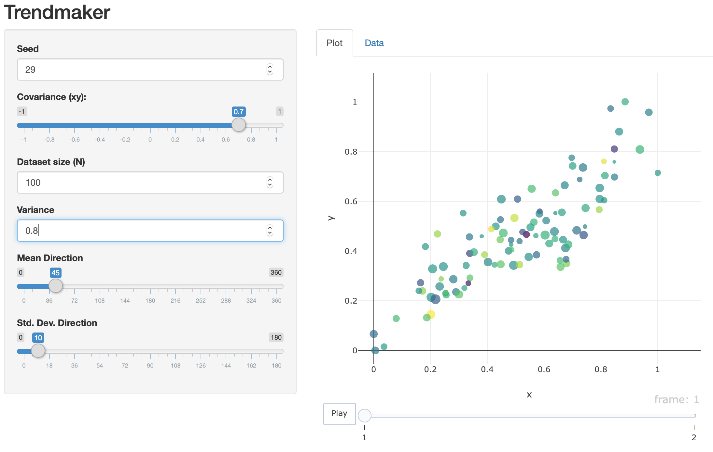

# Trendmaker

Gapminder-style synthetic datasets.



## Running

Open the project on RStudio, and run `app/install_dependencies.R`. Then open `app/app.R` and click "Run App" on the top-right corner.

## Customizing

The function `generate` is responsible for creating a pair of dataframes, which hold the data values in the start and end frames of the animation.

## Deploying on Docker

```
cd trendmaker
docker build -t trendmaker .
docker run -p 80:80 trendmaker
```

Then hit http://localhost on your browser.
